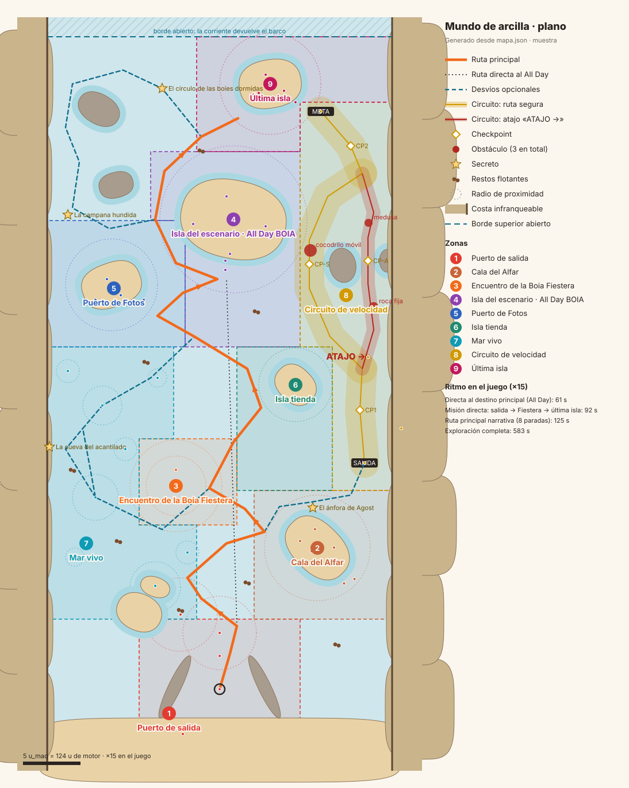

# Mundo de arcilla · diseño del mapa de lanzamiento

Estado: `muestra`. Nombres, historia, textos y colores son una propuesta para Álvaro. La fuente de
datos es [`mapa.json`](mapa.json): las secciones marcadas como generadas salen de ahí y de
`mundos/temas.py` con `python3 mundos/arcilla/herramientas/diseno.py`, y no se editan a mano.

## Concepto

Un mar entre dos costas de Alicante, hecho de plastilina. Se sale de un puerto pequeño abajo del
mapa y se navega hacia arriba, isla a isla, hasta la fiesta que acaba al amanecer. Es el mundo del
barco B05, el remolcador de arcilla («Botijo», propuesta): todo lo que hay en él parece modelado a
mano y un poco torcido, con huellas de dedos, porque está hecho así.

Tres ideas mandan:

1. **Islas fijas, mar vivo** (§1 de la v14). Las islas son pocas y claras; el agua entre ellas está
   llena de cosas pequeñas que cambian: restos, cofres, botellas, un delfín, un remolino.
2. **Una misión que ordena el paseo.** La Boia Fiestera está atrapada entre cocodrilos a un tercio del
   recorrido y quiere llegar a la última isla. La misión cruza el mapa entero sin obligar a nada: se
   puede rodear todo lo opcional.
3. **Primero BOIA, después la venta.** La primera isla es la Cala del Alfar (horno, paella, pista de
   baile), no una taquilla. Las dos islas comerciales (tienda y escenario) no van seguidas: entre
   ellas está el Puerto de Fotos.

## Historia del mundo (propuesta)

El mar de BOIA queda entre dos costas: al oeste, acantilados de arenisca con pinos, casitas y una
torre vigía; al este, una playa larga. Abajo está El Varadero, el puerto de donde salen los barcos
cada temporada; arriba, el mar sigue, pero todavía no se ha publicado.

El barco de arcilla salió del horno de la Cala del Alfar. Lo modelaron para llevar botijos a las
fiestas, pero salió demasiado alegre para ser de carga, así que ahora lleva la fiesta: paja, palmera
y bombillas.

Cada temporada termina en la Isla del Amanecer (la última isla), donde la fiesta acaba cuando sale el
sol. Este año la Boia Fiestera, que siempre llega la primera para colgar las luces, se ha quedado en
el Remanso, rodeada por cuatro cocodrilos que no la dejan pasar. No son malos: sólo muy pesados. En
cuanto llega un barco, se sumergen muertos de vergüenza.

Por el camino: un náufrago que lleva «tres fiestas» esperando, una tienda que es sólo el escaparate de
la de verdad, un puerto donde se revelan las fotos de BOIA y el escenario del All Day. Y por la costa
este, un circuito para quien tiene prisa: El Freu, un paso estrecho entre las rocas y la playa.

## Forma del mapa

- **Costas laterales infranqueables** en x = −15 y x = +15 (REQ-MUN-011): acantilados al oeste y
  playa al este. Abajo, el paseo del puerto. Arriba, **borde abierto**: sin pared, con una fila de
  boies de temporada; más allá, la corriente del motor (`openEdgeCurrent`) devuelve el barco. El mapa
  crece añadiendo filas por arriba sin tocar nada de lo que hay.
- **Ruta principal** (naranja en el plano): salida → boia de la entrada → náufrago → Cala del Alfar →
  Boia Fiestera → tienda → Puerto de Fotos → escenario del All Day → última isla. Zigzaguea de un lado
  a otro para que las actividades queden repartidas y no en una esquina (REQ-MUN-015).
- **Desvíos opcionales** (azul discontinuo): remolino y delfín, cueva del acantilado, ánfora de Agost,
  islas de Faro y Cañón y boies dormidas. Todos se pueden rodear.
- **Circuito lateral** (amarillo y rojo) por la costa este, desde la Cala hasta al lado de la última
  isla (REQ-AVE-026): es un atajo de la misión. Se bifurca en una **ruta segura** ancha que rodea el
  islote Els Dents por agua abierta y un **atajo** estrecho por El Freu, pegado a la costa, con el
  cartel «ATAJO →» apuntando hacia él; se unen antes de meta (REQ-AVE-031). Sólo tres obstáculos:
  roca y medusa en el atajo, cocodrilo móvil en la ruta segura (REQ-AVE-030).
- **Secretos** (estrellas): cueva del acantilado, ánfora de Agost, campana hundida y círculo de las
  boies dormidas. Cada uno se insinúa cerca de una isla sin bloquear nada (REQ-AVE-015).
- **Faro y Cañón** están en L1 desde D-20 (corrige D-02 y D-08): la Isla del Faro (Vigilancia del faro)
  y el Puig Campana (Cañón contra tiburones) están en el mapa compartido, en la banda oeste, al norte
  del Puerto de Fotos (`faro` y `canon` en `packages/world/src/worlds/arcilla/map.ts`), y arrancan sus
  minijuegos con INICIAR_MINIJUEGO. En `mapa.json` ocupan el antiguo solar L2 (`minijuegos`, con
  `solares_l2` vacío); sólo el desvío `d_solar` conserva el nombre antiguo.

## Zonas

<!-- generado:zonas -->
| # | Zona | Papel en el recorrido | Encuentro | Piezas | REQ |
|---|---|---|---|---:|---|
| 1 | [Puerto de salida](#puerto) | Salida del barco y primera boia, en la bocana, justo delante de la proa: es imposible no pasarle al lado. | La boia de la entrada | 15 | AVE-001, AVE-002, AVE-003, AVE-004, AVE-023, MUN-015 |
| 2 | [Cala del Alfar](#cala) | La casa del barco, primera isla del recorrido. | La alfarera | 16 | AVE-012, AVE-013, AVE-014, MUN-015 |
| 3 | [Encuentro de la Boia Fiestera](#fiestera) | Misión principal. | Boia Fiestera y cuatro cocodrilos | 7 | AVE-005, AVE-006, AVE-007, AVE-009, AVE-010, MUN-015 |
| 4 | [Isla del escenario · All Day BOIA](#allday) | La gran isla comercial y destino principal: el escenario del All Day BOIA con su taquilla. | La taquillera | 15 | PRO-006, COM-005, AVE-012, AVE-013, AVE-014, MUN-015, MUN-018 |
| 5 | [Puerto de Fotos](#fotos) | Desvío corto a la izquierda, entre la tienda y el escenario: la galería de BOIA como lugar del mundo. | La fotógrafa | 10 | AVE-022, COM-031, MUN-015 |
| 6 | [Isla tienda](#tienda) | Escaparate de la tienda externa: camisetas, tote bags y pegatinas. | La tendera | 10 | COM-033, AVE-021, MUN-015 |
| 7 | [Mar vivo](#marvivo) | El mar que da razones para volver: náufrago antes de la primera isla, restos que se regeneran, cofres fugaces, delfín, remolino y botellas. | El náufrago y el delfín | 8 | AVE-009, AVE-016, AVE-017, AVE-018, AVE-019, AVE-020, AVE-021, IDE-040, IDE-041, IDE-042 |
| 8 | [Circuito de velocidad](#circuito) | Atajo lateral por la costa este hacia la última isla. | El juez de carrera | 13 | AVE-026, AVE-027, AVE-028, AVE-029, AVE-030, AVE-031, AVE-032, AVE-033, MUN-016 |
| 9 | [Última isla](#ultima) | Destino de la Boia Fiestera y final del recorrido: la fiesta que acaba al salir el sol. | Las boies amigas | 10 | AVE-008, AVE-010, AVE-026, MUN-016 |

### 1 · Puerto de salida 

Propuesta de nombre: **El Varadero** (muestra).

**Papel.** Salida del barco y primera boia, en la bocana, justo delante de la proa: es imposible no pasarle al lado.

**Piezas (15).** El paseo; Escolleras de cantos rodados; Muelle de tablones; Caseta del puerto; Casitas blancas del paseo; Farolas; Norays; Cajas y redes; Balizas roja y verde de la bocana; Anillo de salida; La boia de la entrada; Bocadillo de arcilla; Boia de WhatsApp; Gaviotas; La guardamuelle.

**Encuentro: La boia de la entrada.** Al salir del anillo, la boia salta con un «plop», habla en bocadillos de 1,5 s y explica la misión; se puede saltar tocando. Si el barco se aleja, protesta en broma.

| Objeto | Comportamientos (§48) | Parámetros |
|---|---|---|
| Anillo de salida | SPAWN/RESPAWN | posición fija; respawn aquí si el barco queda en tierra |
| Boia de la entrada | PROXIMIDAD + DIÁLOGO + LOGRO/TRIGGER | radio 3,2; 4 bocadillos a 1,5 s; logro «Primera boia» una vez |
| Boia de WhatsApp | PROXIMIDAD + EVENTO/CONTENIDO | radio 1,6; abre el acceso voluntario a WhatsApp |
| Escolleras y paseo | COLISIÓN | bloquear |
| Gaviotas, bandera | DECORATIVO | loop |

**REQ que cubre.** REQ-AVE-001, REQ-AVE-002, REQ-AVE-003, REQ-AVE-004, REQ-AVE-023, REQ-MUN-015.

**Texto de muestra.** «¡Plop! Bienvenido. Una Boia Fiestera se ha perdido entre cocodrilos: encuéntrala y llévala a la última isla.» «Por el camino hay monedas, descuentos y algún secreto. Toca para seguir.»

**Paleta local.** `red` #E43B30, `white` #FFF7EC, `whitewash` #F4EFE6, `blue_door` #2F6FB0, `stone` #B9AA96, `wood` #B8763F, `sea_shallow` ?.

**Día y noche.** De día manda el rojo y blanco de la boia sobre el turquesa de la bocana. De noche se encienden la luz de la boia, las dos balizas (roja y verde), las farolas y la ventana de la caseta; el anillo de salida brilla suave.

### 2 · Cala del Alfar 

Propuesta de nombre: **Cala del Alfar** (muestra).

**Papel.** La casa del barco, primera isla del recorrido. Enseña qué es BOIA antes de vender nada: horno, paella, pista y guirnalda. Isla secundaria con recuerdos.

**Piezas (16).** Isla y bajío; Colina; Horno de alfarero; Humo del horno; Botijos secando; Chiringuito de paja; Paella del mediodía; Pista de azulejos; Embarcadero de los botijos; Amarre del barco; Palmeras; Guirnaldas entre palmeras; Torno de alfarero; La alfarera; Leña; Estante de cántaros.

**Encuentro: La alfarera.** Trabaja en el torno junto al horno. Al acercarse, cuenta que el barco salió de ese horno y regala la primera visita.

| Objeto | Comportamientos (§48) | Parámetros |
|---|---|---|
| Isla | PROXIMIDAD + EVENTO/CONTENIDO | radio 4,6; recuerdos de la isla y bloque Próximos eventos |
| Isla, primera llegada | LOGRO/TRIGGER + RECOMPENSA | descubrimiento; puntos una vez |
| La alfarera | PROXIMIDAD + DIÁLOGO | radio 1,8; 2 bocadillos |
| Humo, fuego, guirnalda | DECORATIVO | loop |
| Isla y embarcadero | COLISIÓN | bloquear |

**REQ que cubre.** REQ-AVE-012, REQ-AVE-013, REQ-AVE-014, REQ-MUN-015.

**Texto de muestra.** «Aquí se coció tu barco. Todavía está caliente.» «De día la cala cocina; de noche, baila.»

**Paleta local.** `terracotta` #C8643A, `thatch` ?, `sand` #EBCF9E, `grass` #7DB043, `tile_a` #FFF7EC, `tile_b` #2C62BE, `rice` #F2B233.

**Día y noche.** De día humea el horno y hierve la paella. De noche la guirnalda y la pista de azulejos toman la cala, el horno brilla por la boca y el chiringuito se ilumina.

### 3 · Encuentro de la Boia Fiestera 

Propuesta de nombre: **El Remanso de los Cocodrilos** (muestra).

**Papel.** Misión principal. La Boia Fiestera flota rodeada de cuatro cocodrilos; al acercarse, se sumergen uno a uno y ella sube a bordo.

**Piezas (7).** La Boia Fiestera; Globos de la Fiestera; Cocodrilos; Anillos de onda; Burbujas; Matas de posidonia; Rocas del remanso.

**Encuentro: Boia Fiestera y cuatro cocodrilos.** Ella pide ayuda en bocadillos. Al entrar el barco en 4,0, los cocodrilos reaccionan y se sumergen uno a uno con ondas y burbujas; en 2,6 ella sube a bordo y sale el aviso «Nueva tripulante a bordo · Boia Fiestera rescatada · Destino: última isla».

| Objeto | Comportamientos (§48) | Parámetros |
|---|---|---|
| Boia Fiestera | PROXIMIDAD + DIÁLOGO + LOGRO/TRIGGER | radio 2,6; rescate; pasa al slot TRIPULANTE; destino por ID de temporada |
| Cocodrilo (×4) | COLISIÓN + PROXIMIDAD | ralentizar 60 % durante 2 s; al entrar en 4,0 se sumerge (uno cada 0,4 s) |
| Ondas y burbujas | DECORATIVO | se disparan al sumergirse |
| Rocas | COLISIÓN | rebote suave |

**REQ que cubre.** REQ-AVE-005, REQ-AVE-006, REQ-AVE-007, REQ-AVE-009, REQ-AVE-010, REQ-MUN-015.

**Texto de muestra.** «¡Eh, barquito! Estos señores no me dejan ir a la fiesta.» «¿Me llevas a la última isla? Te lo pagaré bailando.»

**Paleta local.** `fiestera` #F2557A, `fiestera_band` #FFD23F, `croc` #5E9A3C, `croc_belly` #D6E08A, `posidonia` #3F7F4A, `foam` #D9F3F7.

**Día y noche.** De día, verdes y naranjas sobre el agua oscura del remanso. De noche la guirnalda de la Fiestera se enciende y los ojos de los cocodrilos brillan amarillos.

### 4 · Isla del escenario · All Day BOIA 

Propuesta de nombre: **Isla Gran** (muestra).

**Papel.** La gran isla comercial y destino principal: el escenario del All Day BOIA con su taquilla. Variante «a la venta» (la del render) y variante «recuerdo».

**Piezas (15).** Isla y bajío; Escenario con techo; Altavoces; Torres de luces; Público; Barra de paja; Taquilla; Cartel del evento (muestra); Arco de entrada; Muelle de llegada; Palmeras; Guirnaldas; Mástiles con banderas; Sombrillas y hamacas; Cabina.

**Encuentro: La taquillera.** Al entrar en el radio de la isla se abre el panel del evento; la taquillera saluda desde la taquilla si el evento está a la venta. En «recuerdo», la taquilla se cierra y el cartel pasa a fotos, artistas y relato.

| Objeto | Comportamientos (§48) | Parámetros |
|---|---|---|
| Isla | PROXIMIDAD + EVENTO/CONTENIDO | radio 6,4; panel del evento, recuerdos y Próximos eventos |
| Taquilla | TICKET | evento muestra; desaparece al pasar a histórico |
| Isla, primera llegada | LOGRO/TRIGGER + RECOMPENSA | descubrimiento; puntos una vez |
| Público, luces | DECORATIVO | loop |
| Isla y muelle | COLISIÓN | bloquear |

**REQ que cubre.** REQ-PRO-006, REQ-COM-005, REQ-AVE-012, REQ-AVE-013, REQ-AVE-014, REQ-MUN-015, REQ-MUN-018.

**Texto de muestra.** «All Day BOIA: de la paella al amanecer. Entradas a la venta (muestra).» «¿Llegas en barco? Pasa por el arco, que la fiesta está dentro.»

**Paleta local.** `band` #F26A1B, `stage_wood` #A9683A, `speaker` #2D3550, `thatch` ?, `canvas` #F1E4CC, `person_a` #F26A1B, `person_b` #2C62BE.

**Día y noche.** De día, sombrillas, hamacas y el toldo naranja. De noche el escenario se enciende en ámbar y magenta, las torres de luces y las guirnaldas marcan el perímetro y el público queda a contraluz.

### 5 · Puerto de Fotos 

Propuesta de nombre: **El Revelado** (muestra).

**Papel.** Desvío corto a la izquierda, entre la tienda y el escenario: la galería de BOIA como lugar del mundo.

**Piezas (10).** Isla y bajío; Cámara-kiosco; Marco gigante; Tendedero de fotos; Cuarto oscuro; Trípode; La fotógrafa; Muelle; Palmeras; Bombillas de flash.

**Encuentro: La fotógrafa.** Espera junto al trípode. Si el barco pasa por el marco gigante, dispara el flash y abre la galería.

| Objeto | Comportamientos (§48) | Parámetros |
|---|---|---|
| Isla | PROXIMIDAD + EVENTO/CONTENIDO | radio 4,0; galería general y por evento |
| Marco gigante | PROXIMIDAD + LOGRO/TRIGGER | radio 0,9; logro «Sonríe» una vez |
| La fotógrafa | DIÁLOGO | 2 bocadillos |
| Flashes | DECORATIVO | destello al pasar |
| Isla y muelle | COLISIÓN | bloquear |

**REQ que cubre.** REQ-AVE-022, REQ-COM-031, REQ-MUN-015.

**Texto de muestra.** «Todas las fotos de BOIA se revelan aquí.» «Pasa por el marco y sonríe.»

**Paleta local.** `photo_body` #2B2B33, `photo_lens` #6FA8C8, `photo_paper` #FFFBF2, `darkroom` #B23A2E, `wood` #B8763F.

**Día y noche.** De día, papel blanco y cámara negra sobre la arena. De noche el cuarto oscuro brilla rojo y las bombillas de flash parpadean.

### 6 · Isla tienda 

Propuesta de nombre: **La Botiga** (muestra).

**Papel.** Escaparate de la tienda externa: camisetas, tote bags y pegatinas. Queda entre la Fiestera y las Fotos para que las dos islas comerciales no vayan seguidas.

**Piezas (10).** Isla y bajío; Kiosco con toldo; Mostrador; Tendedero de camisetas; Tote bags; Rollos de pegatinas; Cajas; Palmera; Cartel TIENDA; La tendera.

**Encuentro: La tendera.** Saluda desde el mostrador y abre el panel de la tienda, que enlaza a la tienda externa de BOIA.

| Objeto | Comportamientos (§48) | Parámetros |
|---|---|---|
| Isla | PROXIMIDAD + EVENTO/CONTENIDO | radio 3,2; panel Tienda con enlace externo |
| La tendera | DIÁLOGO | 1 bocadillo |
| Camisetas al viento | DECORATIVO | loop |
| Isla | COLISIÓN | bloquear |

**REQ que cubre.** REQ-COM-033, REQ-AVE-021, REQ-MUN-015.

**Texto de muestra.** «Camisetas, tote bags y pegatinas.» «La tienda de verdad está en tierra; esto es su escaparate.»

**Paleta local.** `shirt_a` #F26A1B, `shirt_b` #2C62BE, `tote` #EADBC0, `sticker_a` #FFD23F, `sticker_b` #29A8E0, `band` #F26A1B.

**Día y noche.** De día, camisetas naranjas y azules al viento. De noche una bombilla bajo el toldo ilumina el mostrador.

### 7 · Mar vivo 

Propuesta de nombre: **Mar de los Restos** (muestra).

**Papel.** El mar que da razones para volver: náufrago antes de la primera isla, restos que se regeneran, cofres fugaces, delfín, remolino y botellas. Ocupa la banda izquierda, pero sus restos y cofres se reparten por todo el recorrido.

**Piezas (8).** El náufrago y su banco de arena; Balsa del náufrago; Grupos de restos flotantes; Cofres fugaces; Delfín; Remolino; Botellas; Gaviotas.

**Encuentro: El náufrago y el delfín.** El náufrago pide que lo acerquen a una fiesta BOIA y da un código de descuento para entradas (10 % en la v14, muestra). El delfín aparece junto al barco, se sumerge y reaparece; seguirlo lleva al cofre.

| Objeto | Comportamientos (§48) | Parámetros |
|---|---|---|
| Náufrago | PROXIMIDAD + DIÁLOGO + RECOMPENSA | radio 2,2; código de descuento de entradas (muestra), una vez |
| Restos | RECOGIBLE + SPAWN/RESPAWN | monedas o puntos; se regeneran al volver a entrar en posiciones semialeatorias |
| Cofre | RECOGIBLE + SPAWN/RESPAWN + RECOMPENSA | aparece 20 s en posiciones temporales; monedas y raramente un cosmético |
| Delfín | SPAWN/RESPAWN + PROXIMIDAD + RECOMPENSA | de vez en cuando junto al barco; seguirlo 3 saltos lleva a cofre, botella o monedas |
| Remolino | PROXIMIDAD + RECOMPENSA (+ fuerza de giro, fuera del catálogo) | radio 1,7; recompensa por segundos dentro con control |
| Botella | PROXIMIDAD + EVENTO/CONTENIDO | radio 1,0; 140 caracteres, apodo y «VER SU CARNET»; sin puntos |

**REQ que cubre.** REQ-AVE-009, REQ-AVE-016, REQ-AVE-017, REQ-AVE-018, REQ-AVE-019, REQ-AVE-020, REQ-AVE-021, REQ-IDE-040, REQ-IDE-041, REQ-IDE-042.

**Texto de muestra.** «¡Llevo tres fiestas esperando aquí! Acércame a una de BOIA y te dejo un regalo.» ««Ven por la música. Quédate por todo lo que ocurre alrededor.» (botella de muestra)»

**Paleta local.** `dolphin` #7F9CB6, `dolphin_belly` #E4ECF0, `chest` #9A5B2E, `gold` #F2C230, `bottle` #E3A33C, `paper` #FFF4DC, `foam` #D9F3F7, `wood` #B8763F.

**Día y noche.** De día el remolino es espuma blanca y el delfín gris azulado. De noche el remolino y la estela del delfín brillan con un turquesa tenue (luminiscencia) y los cofres destellan dorados.

### 8 · Circuito de velocidad 

Propuesta de nombre: **El Freu** (muestra).

**Papel.** Atajo lateral por la costa este hacia la última isla. Se bifurca en una ruta segura y ancha, que rodea el islote Els Dents por agua abierta, y un atajo estrecho («ATAJO →») que pasa por El Freu, pegado a la costa; se unen antes de meta. Sólo tres obstáculos.

**Piezas (13).** Arco de salida; Semáforo de salida; Boies de carril; Arcos de checkpoint; Cartel ATAJO →; Islote Els Dents; Rocas del Freu; Obstáculo: roca; Obstáculo: medusa; Obstáculo: cocodrilo móvil; Grada; El juez de carrera; Arco de meta.

**Encuentro: El juez de carrera.** Desde la grada da la salida con el semáforo y baja la bandera a cuadros en meta. El cronómetro es muy pequeño, arriba; el récord personal se enseña antes y después.

| Objeto | Comportamientos (§48) | Parámetros |
|---|---|---|
| Arco de salida | CHECKPOINT/BOOST | inicio y cuenta atrás; circuito v1 |
| Checkpoints | CHECKPOINT/BOOST | orden CP1 → (CP-S o CP-A) → CP2; WHOOSH y boost de 2 s |
| Cocodrilo móvil | COLISIÓN | ralentizar 60 % durante 2 s; vaivén de 1,6 |
| Roca | COLISIÓN | rebote (obstacleRestitution 0,45) |
| Medusa | COLISIÓN | ralentizar 40 % durante 1,5 s (provisional) |
| Arco de meta | CHECKPOINT/BOOST + LOGRO/TRIGGER | récord personal local con versión de circuito |
| Grada, juez | DECORATIVO | loop |

**REQ que cubre.** REQ-AVE-026, REQ-AVE-027, REQ-AVE-028, REQ-AVE-029, REQ-AVE-030, REQ-AVE-031, REQ-AVE-032, REQ-AVE-033, REQ-MUN-016.

**Texto de muestra.** «Por la derecha, ancho y tranquilo. Por el Freu, rápido y con dientes.» «ATAJO →»

**Paleta local.** `lane_a` #F26A1B, `lane_b` #FFF7EC, `checker_a` #231C1A, `checker_b` #FFF7EC, `rock` #8C7F73, `jelly` #F28BB8, `croc` #5E9A3C.

**Día y noche.** De día, boies de carril naranjas y blancas sobre el azul. De noche cada boia de carril lleva una lucecita, los arcos se encienden y la medusa brilla rosa.

### 9 · Última isla 

Propuesta de nombre: **Isla del Amanecer** (muestra).

**Papel.** Destino de la Boia Fiestera y final del recorrido: la fiesta que acaba al salir el sol. Se llega desde el escenario o por la salida del circuito, que queda al lado.

**Piezas (10).** Isla y bajío; Nicho de la Fiestera; Muelle de llegada; Farolillos; Fuegos artificiales de arcilla; Hoguera; Las boies amigas; Palmeras; Banco de piedra; Banderines.

**Encuentro: Las boies amigas.** Esperan en la orilla. Al llegar con la Fiestera desde cualquier lado, ella baja, se sube al nicho y empiezan los fuegos: celebración, sonido, logro y una recompensa importante (pendiente Álvaro).

| Objeto | Comportamientos (§48) | Parámetros |
|---|---|---|
| Isla | PROXIMIDAD + LOGRO/TRIGGER + RECOMPENSA | radio 4,4 por todos los lados; entrega de la misión por ID de temporada |
| Boies amigas | DIÁLOGO | celebración, 3 bocadillos |
| Fuegos, hoguera | DECORATIVO | secuencia al entregar; loop de noche |
| Isla | EVENTO/CONTENIDO | recuerdos y Próximos eventos |
| Isla y muelle | COLISIÓN | bloquear |

**REQ que cubre.** REQ-AVE-008, REQ-AVE-010, REQ-AVE-026, REQ-MUN-016.

**Texto de muestra.** «¡Lo has conseguido! Aquí la fiesta acaba cuando sale el sol.» «Quédate un rato: esto no se ve desde la orilla.»

**Paleta local.** `lantern` #FFB85C, `firework_a` #FF5DA2, `firework_b` #FFD23F, `stone` #B9AA96, `fire` #FF8A3D.

**Día y noche.** De día, farolillos apagados de papel y banderines. De noche, hoguera, farolillos encendidos y fuegos artificiales de arcilla sobre la isla.
<!-- /generado:zonas -->

## Ruta y ritmo

### Conversión de unidades

| De | A | Cómo |
|---|---|---|
| Blender (u_maq) | u de motor | La eslora del barco B05 en la vista W es 170,37 px del sprite a 88,2759 px/u_maq = **1,93 u_maq**, y en el juego mide `SHIP_LENGTH` = **48 u** (D-15). 1 u_maq = 48 / 1,93 = **24,87 u de motor**. |
| u de motor | px de pantalla | 1 u = 1 px en horizontal a zoom 1 (`packages/world/src/iso.ts`); en vertical el agua se ve a la mitad (proyección 2:1). |
| u_maq | px de la vista general | `ppu` de `render/general.json` (≈68 px/u_maq a 2400 px de ancho). |
| u de motor | segundos | `maxSpeed` = 220 u/s y `acceleration` = 240 u/s² (`packages/engine/src/ship/config.ts`): 8,85 u_maq/s. Se sale de parado, se acelera 0,92 s y se navega a velocidad máxima. No se descuentan giros ni lectura: es una cota inferior. |
| maqueta | juego | **Factor ×15** en posiciones; tamaños a 1:1. La maqueta comprime el mar para que el mapa entero quepa en una imagen: en el juego las islas y el barco miden lo mismo y el agua entre zonas es 15 veces más larga. |

El factor ×15 no es un ajuste para cuadrar números: sale de pedir que la ruta directa dure un minuto.
La maqueta mide la **forma** del recorrido (la relación entre la ruta directa y la de exploración es
9,6, cerca del 10 que piden los dos objetivos), y el factor la lleva a la escala del juego.

### Tiempos

`python3 mundos/arcilla/herramientas/ritmo.py`

<!-- generado:ritmo -->
Velocidad del motor: 220 u/s (8.846 u_maq/s), aceleración 240 u/s². 1 u_maq = 24.87 u de motor. Factor de juego: ×15.

| Ruta | Longitud (u_maq) | En el juego (u de motor) | Tiempo en la maqueta | Tiempo en el juego | Objetivo | Juego / objetivo |
|---|---:|---:|---:|---:|---:|---:|
| Directa al destino principal (All Day) | 35.9 | 13.398 | 4.5 s | 61.4 s (1.0 min) | 60 s | 102 % |
| Misión directa: salida → Fiestera → última isla | 54.3 | 20.248 | 6.6 s | 92.5 s (1.5 min) | — | — |
| Ruta principal narrativa (8 paradas) | 73.5 | 27.423 | 8.8 s | 125.1 s (2.1 min) | — | — |
| Exploración completa | 343.6 | 128.167 | 39.3 s | 583.0 s (9.7 min) | 600 s | 97 % |
| Vuelta al circuito por la ruta segura | 35.2 | 13.150 | 4.4 s | 60.2 s (1.0 min) | — | — |
| Vuelta al circuito por el atajo | 32.2 | 12.000 | 4.1 s | 55.0 s (0.9 min) | — | — |
<!-- /generado:ritmo -->

Lectura: con ×15, la ruta directa al All Day da un minuto y la exploración completa, 9,7 minutos, muy
cerca de los dos objetivos de REQ-MUN-017. La exploración recorre en orden todas las sorpresas
principales: boies, náufrago, restos, Cala, ánfora, las dos ramas del circuito, Fiestera, delfín,
cueva, remolino (dos vueltas), botellas, cofres, tienda, Fotos, campana, escenario, islas de Faro y
Cañón (sin jugar los minijuegos), círculo de boies y última isla.

Lo que esto implica para el juego, y hay que decidirlo antes de construir el mapa real: a ×15 el mapa
mide unas 11.200 u de ancho y 23.500 de alto, unas 28 pantallas de móvil de ancho. Es mucho mar. Hay
dos palancas: bajar `maxSpeed` (a 150 u/s el factor baja a ~10) o aceptar que un minuto de navegación
directa es un mundo grande y llenarlo de mar vivo. La recomendación es probarlo en móvil con dos
factores (×10 y ×15) antes del hito 1.

## Paleta del mundo

<!-- generado:paleta -->
Papeles nuevos del tema de arcilla (`Arcilla.HEX` en `mundos/temas.py`). Ninguna pieza lleva un color suelto: cada objeto nombra un papel y el tema lo traduce a material.

| Papel | Hex | Dónde se usa |
|---|---|---|
| `sea` | `#1A7AA6` | allday |
| `shallow` | `#3AA3C4` | allday, marvivo |
| `ink` | `#231C1A` | allday, circuito, fiestera, fotos, tienda |
| `hair` | `#4A3024` | allday, cala, circuito, fotos, marvivo, tienda |
| `whitewash` | `#F4EFE6` | allday, costas, puerto, tienda, ultima |
| `blue_door` | `#2F6FB0` | costas, marvivo, puerto |
| `stone` | `#B9AA96` | allday, circuito, costas, puerto, ultima |
| `cliff` | `#D69B5F` | costas |
| `cliff_dark` | `#A86E3E` | costas, extras |
| `pine` | `#4E7D3A` | costas |
| `roof_tile` | `#C4553A` | costas, puerto |
| `fiestera` | `#F2557A` | circuito, extras, fiestera, ultima |
| `fiestera_band` | `#FFD23F` | allday, extras, fiestera, ultima |
| `croc` | `#5E9A3C` | puerto |
| `croc_dark` | `#3F6E28` | piezas.py |
| `croc_belly` | `#D6E08A` | piezas.py |
| `posidonia` | `#3F7F4A` | circuito, extras, fiestera |
| `dolphin` | `#7F9CB6` | piezas.py |
| `dolphin_belly` | `#E4ECF0` | piezas.py |
| `chest` | `#9A5B2E` | piezas.py |
| `gold` | `#F2C230` | costas, extras, fotos |
| `coin` | `#F7D046` | costas, fotos, marvivo |
| `bottle` | `#E3A33C` | allday |
| `cork` | `#B98556` | piezas.py |
| `paper` | `#FFF4DC` | allday |
| `jelly` | `#F28BB8` | fiestera, fotos |
| `lane_a` | `#F26A1B` | circuito, costas, extras, puerto, ultima |
| `lane_b` | `#FFF7EC` | circuito |
| `checker_a` | `#231C1A` | circuito |
| `checker_b` | `#FFF7EC` | circuito |
| `photo_body` | `#2B2B33` | fotos |
| `photo_lens` | `#6FA8C8` | fotos |
| `photo_paper` | `#FFFBF2` | allday, fotos |
| `darkroom` | `#B23A2E` | fiestera, fotos |
| `tote` | `#EADBC0` | tienda |
| `sticker_a` | `#FFD23F` | allday, fotos, tienda |
| `sticker_b` | `#29A8E0` | allday, fotos, tienda |
| `canvas` | `#F1E4CC` | allday, marvivo, tienda |
| `stage_wood` | `#A9683A` | allday, tienda |
| `firework_a` | `#FF5DA2` | extras, fiestera, ultima |
| `firework_b` | `#FFD23F` | circuito, costas, fiestera, ultima |
| `firework_c` | `#29A8E0` | circuito, extras, fiestera, ultima |
| `sea_deep` | `#0A4459` | marvivo |
| `seagull` | `#FAFAF5` | piezas.py |
| `gull_wing` | `#9AA3AD` | piezas.py |
| `beak` | `#F2A33A` | piezas.py |
| `rope` | `#C9A36B` | allday, cala, circuito, extras, fotos, marvivo, puerto, ultima |
| `metal` | `#8C8F99` | allday, extras, fotos |
| `net` | `#5F7F86` | puerto |
| `person_e` | `#8E3FB0` | allday, circuito, fotos, ultima |
| `person_f` | `#FFD23F` | allday, cala, circuito, extras |
| `hat` | `#F4EFE6` | allday, circuito, puerto |
| `stripe` | `#2C62BE` | circuito, costas, extras, ultima |
| `barrel` | `#BC7A40` | piezas.py |
| `chimney` | `#E2583C` | costas, puerto |
| `frame` | `#3E8A58` | piezas.py |
| `hull` | `#4FAA66` | piezas.py |

Papeles que brillan (`Arcilla.GLOW`): color y fuerza de emisión de día, atardecer y noche.

| Papel | Hex | Día | Atardecer | Noche |
|---|---|---:|---:|---:|
| `bulb` | `#FFD27E` | 1.5 | 5.0 | 16.0 |
| `fire` | `#FF8A3D` | 3.0 | 4.0 | 9.0 |
| `lantern` | `#FFB85C` | 0.0 | 2.5 | 7.0 |
| `croc_eye` | `#FFE45C` | 0.0 | 1.0 | 6.0 |
| `window_lit` | `#FFD9A0` | 0.0 | 1.5 | 5.0 |
| `spawn_glow` | `#BFF3FF` | 0.0 | 0.8 | 3.0 |
| `stage_light` | `#FFB347` | 0.3 | 3.0 | 12.0 |
| `stage_magenta` | `#FF5DA2` | 0.3 | 3.0 | 12.0 |
| `lumi` | `#7FF6E6` | 0.0 | 0.4 | 2.2 |
| `red_light` | `#FF3B2E` | 0.0 | 2.0 | 7.0 |
| `green_light` | `#3BFF6A` | 0.0 | 2.0 | 7.0 |
| `flash` | `#FFFFFF` | 0.2 | 2.0 | 8.0 |
<!-- /generado:paleta -->

## Decisiones tomadas en esta exploración (§49.18)

Todas son reversibles y están en `mapa.json`:

- **Las dos ramas del circuito se invirtieron** respecto al primer boceto: el atajo va por la derecha,
  pegado a la costa, para que el cartel «ATAJO →» apunte de verdad al atajo.
- **La ruta principal sube por el oeste del escenario** hasta la última isla. Así el circuito es una
  alternativa real por el este y no un carril paralelo a la ruta.
- **Los primeros planos son de día y de noche; el atardecer, sólo en la vista general.** El
  atardecer es la hora que menos información añade de cerca.
- **El barco no está en la vista general**: el visor lo dibuja encima con sus sprites de 8 direcciones.
  Si estuviera en la imagen, el modo recorrido enseñaría dos barcos.
- **La boia de WhatsApp** (REQ-AVE-023, provisional) va en el puerto, al lado de la de la entrada:
  quien acaba de llegar es quien más probablemente quiere seguir a BOIA.

## Desviaciones de la spec

- **Día y noche (REQ-MUN-005)** es L2 y provisional. Aquí sólo existe en la maqueta, para juzgar cómo
  se lee el mundo a distintas horas; no se propone para L1.
- **Remolino (REQ-AVE-019).** El catálogo de §48 no tiene un efecto de fuerza que haga girar el barco.
  Se configura con PROXIMIDAD y RECOMPENSA por tiempo dentro, y la fuerza de giro queda como mecánica
  nueva: una variante de COLISIÓN («girar») o un módulo CORRIENTE, que habría que programar una vez
  (REQ-MUN-027).
- **Medusa del circuito (REQ-AVE-030).** El valor de ralentización (40 % durante 1,5 s) es provisional,
  como la propia medusa en la spec.

## Preguntas para Álvaro

1. **Nombres.** ¿Te sirven los de trabajo (El Varadero, Remanso de los Cocodrilos, Isla Gran, El
   Revelado, La Botiga, El Freu, Isla del Amanecer)? ¿Castellano o valenciano (Botiga, Freu) según el
   sitio?
2. **La historia.** ¿Te encaja que la temporada acabe en la Isla del Amanecer y que la Fiestera sea la
   que cuelga las luces? ¿Los cocodrilos pesados, pero no malos?
3. **Referencias reales.** ¿Podemos citar Agost (botijos, ánfora) y las torres vigía de la costa? ¿Hay
   otros lugares de Alicante que BOIA quiera en el mapa?
4. **Descuentos.** El náufrago da un código de entradas (10 % en la v14) y el ánfora uno de tienda
   (20 % en la v14). ¿Qué descuentos y con qué condiciones?
5. **La recompensa importante** de entregar a la Fiestera: ¿qué es?
6. **Tamaño del mundo.** Con un minuto de navegación directa el mapa es grande (ver «Ritmo»). ¿Prefieres
   menos mar y un barco más lento, o mar grande y lleno de sorpresas?
7. **Variante recuerdo.** Cuando un All Day termina, ¿la isla pasa a enseñar fotos en el escenario, o
   prefieres que cambie algo más visible (sin público, con banderas de otro color)?
